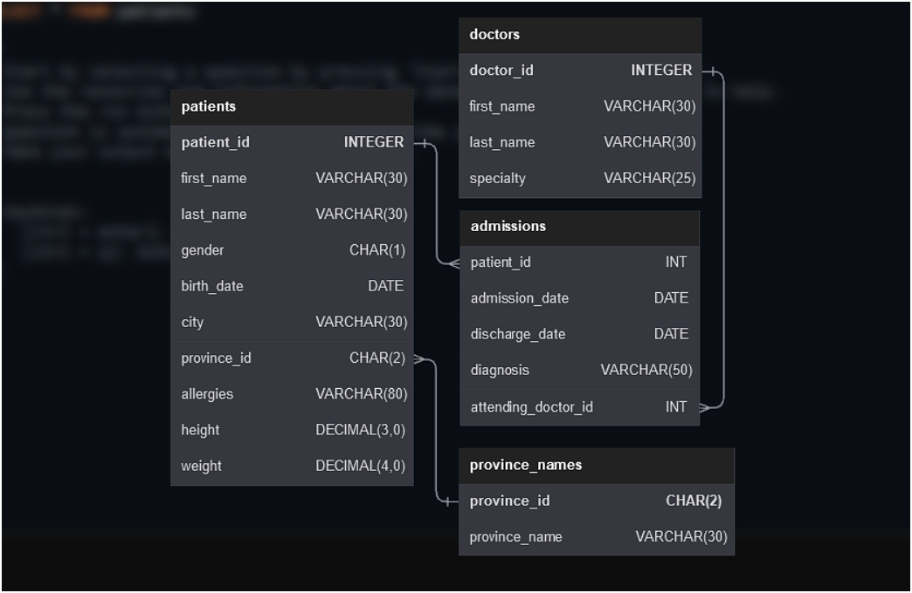
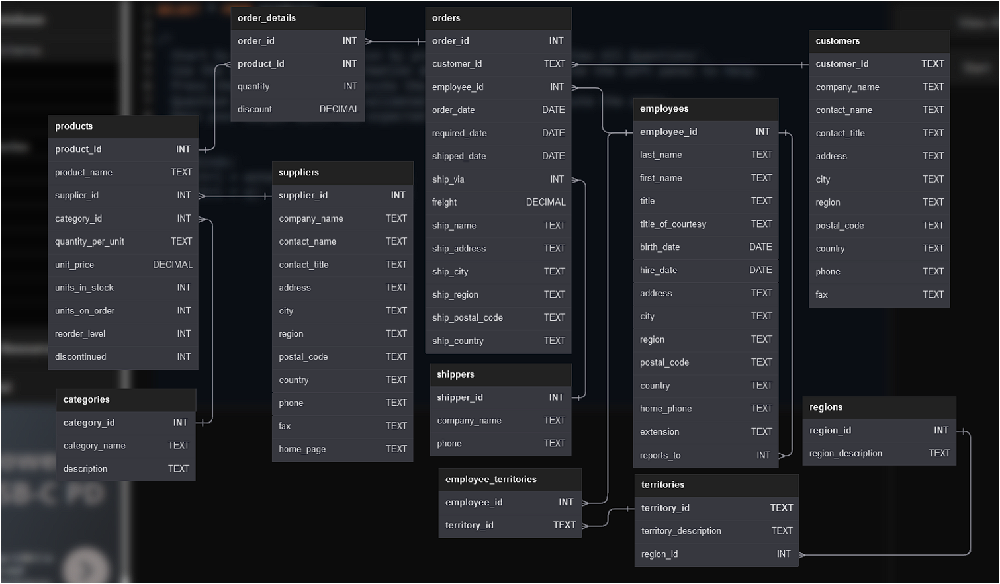

# SQL Practice Repository

This repository contains SQL solutions and practice problems from various coding platforms including HackerRank, LeetCode, and SQL-Practice. It serves as a comprehensive collection of SQL queries, problem solutions, and database practice exercises.

## 📚 Repository Overview

This repository is organized to help developers improve their SQL skills through practical problem-solving. Each SQL file contains solutions to specific database challenges, covering various SQL concepts and techniques.

## 🗂️ Problem Categories

The repository includes solutions for problems covering:

- **Basic SQL Queries**: SELECT, WHERE, ORDER BY, LIMIT
- **Aggregation Functions**: COUNT, SUM, AVG, MAX, MIN
- **Joins**: INNER JOIN, LEFT JOIN, RIGHT JOIN, FULL JOIN
- **Subqueries and CTEs**: Complex nested queries and Common Table Expressions
- **Window Functions**: ROW_NUMBER, RANK, DENSE_RANK, LAG, LEAD
- **Data Manipulation**: INSERT, UPDATE, DELETE, ALTER
- **Advanced SQL**: Recursive CTEs, Pivoting, Complex aggregations

## 🏥 Database Schemas

### 1. Hospital Database Schema

The Hospital database contains medical-related tables for patient management, admissions, and medical records.



**Key Tables:**
- Patients information and demographics
- Medical admissions and discharges
- Diagnosis and treatment records
- Healthcare provider details

### 2. NorthWind Database Schema

The NorthWind database represents a business application with sales, inventory, and customer management tables.



**Key Tables:**
- Products and categories
- Orders and order details
- Customers and suppliers
- Employees and territories
- Sales transactions

## 📁 File Organization

The repository contains SQL files named according to their problem numbers and descriptions:

- **LeetCode Problems**: Files with problem numbers (e.g., `196. Delete Duplicate Emails.sql`)
- **HackerRank Problems**: Various SQL challenges and practice problems
- **Custom Practice**: Patient management, weather observations, and other domain-specific queries

## 🚀 Getting Started

1. **Clone the repository:**
   ```bash
   git clone <repository-url>
   cd SQL
   ```

2. **Choose a problem category** based on your learning goals
3. **Review the SQL solutions** to understand different approaches
4. **Practice with your own database** using the provided schemas
5. **Modify queries** to experiment with different SQL techniques

## 💡 Learning Path

### Beginner Level
- Start with basic SELECT queries
- Practice WHERE clauses and filtering
- Learn basic aggregation functions

### Intermediate Level
- Master JOIN operations
- Practice subqueries and CTEs
- Learn window functions

### Advanced Level
- Complex aggregations and pivoting
- Recursive queries
- Performance optimization techniques

## 🛠️ Database Setup

To practice with the schemas shown in the images:

1. **Hospital Database**: Set up a local database with patient management tables
2. **NorthWind Database**: Use the standard NorthWind sample database available for most SQL platforms

## 📊 Problem Sources

- **LeetCode**: Algorithm and database problems
- **HackerRank**: SQL practice and certification
- **SQL-Practice**: Database-specific challenges
- **Custom Problems**: Real-world scenarios and practice cases

## 🤝 Contributing

Feel free to contribute by:
- Adding new SQL solutions
- Improving existing queries
- Adding more database schemas
- Enhancing documentation
- Suggesting new problem categories

## 📝 License

This repository is open source and available for educational purposes.

## 🔗 Useful Resources

- [SQL Documentation](https://www.w3schools.com/sql/)
- [LeetCode Database Problems](https://leetcode.com/problemset/database/)
- [HackerRank SQL Track](https://www.hackerrank.com/domains/sql)
- [SQL Practice Platforms](https://sqlzoo.net/)

---

**Happy SQL Learning! 🎯**
